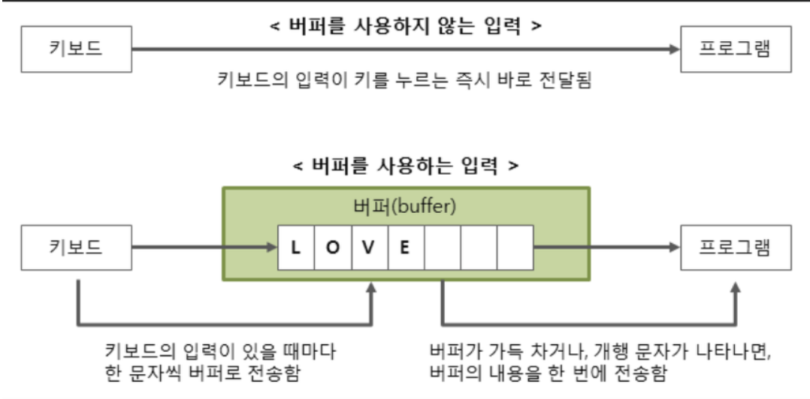

# BufferedReader 와 BufferedWriter 

* 자바의 입출력 최상단에 위치하는 버퍼를 이용해서 읽고쓰는 클래스이다.

* 해당 클래스를 이용할 경우 입출력의 효율 속도가 좋아진다.

## 왜 효율이 좋아질까?



위 그림을 본다고 이해가 바로 가진 않을 것이다.

한번 거쳐가는데 왜 더 빠른가?

하드디스크의 경우 원체 속도가 엄청느릴뿐 아니라 키보드와 모니터같은 외부 장치와의 데이터 입출력은 생각보다 시간이 많이 걸리는 작업으로
키보드의 글자 한글자를 바로 프로그램으로 전달하는것보다 버퍼라는 공간에 입출력해야하는 문자를 한대모아 데이터를 전송하는것이 훨씬 효율적이다.

예시를 좀더 쉽게 들자면 200ml의 물컵 5번으로 1L 수조를 채울 수 있지만 1L의 물컵 1번으로 1L 수조를 채우는 느낌이다.

그렇다면 이런 버퍼를 입출력을 담당해주는 자바의 객체가 BufferedReader와 BufferedWriter이다.

## BufferedReader

BufferedReader는 자바의 다른 입력을 다루는 Scanner 객체와는 다른 차이점들이 몇가지 존재한다.

1. 입력받는 데이터가 String으로 고정되므로 Integer나 Char형태는 가공을 하여야 사용가능하다.
2. readLine() 즉, 한 줄을 단위로 받기 때문에 한줄에 여러 데이터가 나누어져있다면 가공하여야한다.
3. 단, Scanner보다 입력 처리가 빠르다.

## BufferedReader 예제

BufferedReader는 앞서 말한거처럼 readLine() 메서드를 활용해서 라인단위로 읽는다.
readLine의 반환값은 무조건 String이기 떄문에 다른 자료형은 가공을 하여야한다.

만약 공백단위의 데이터를 읽고싶다면 StringTokenizer 객체를 활용하면된다.

```java
import java.io.BufferedReader;
import java.io.IOException;
import java.io.InputStreamReader;
import java.util.StringTokenizer;

public class Main {
    public static void main(String[] args) {
        try {
            BufferedReader br = new BufferedReader(new InputStreamReader(System.in));

            int num = Integer.parseInt(br.readLine());
            br.close();
            StringTokenizer st=new StringTokenizer(br.readLine());
            System.out.println(st.nextToken());
            String line = "";
            while (line = br.readLine() != null) {
                System.out.println(line);
            }
        } catch (IOException e) {
            e.printStackTrace();
            System.out.println(e.getMessage());
        }
    }
}
```

## BufferedWriter

출력문으로 가장 자주사용되는 System.out.print 메서드와 비슷하다.
BufferedReader와 마찬가지로 버퍼를 사용하기 떄문에 효율이 좋다.


## BuffereWriter 정수형 출력 이슈

정수형을 BufferedWriter로 바로 출력하려고 할경우 문자열이 꺠지거나 원하는 값이 나오지않기 때문에 문자열로 변환하여야한다.